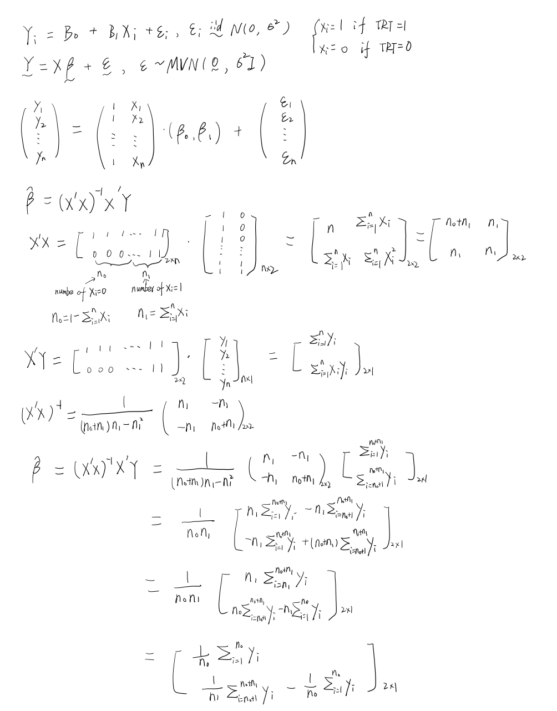
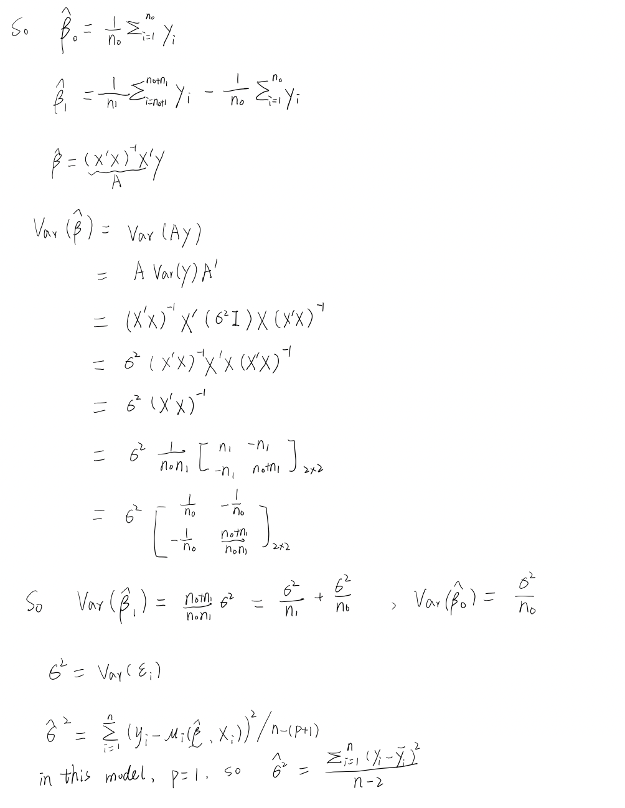
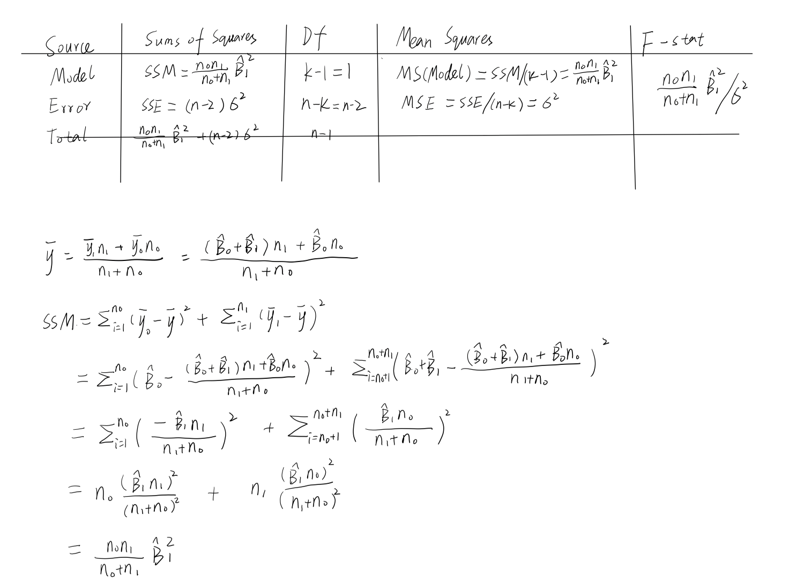
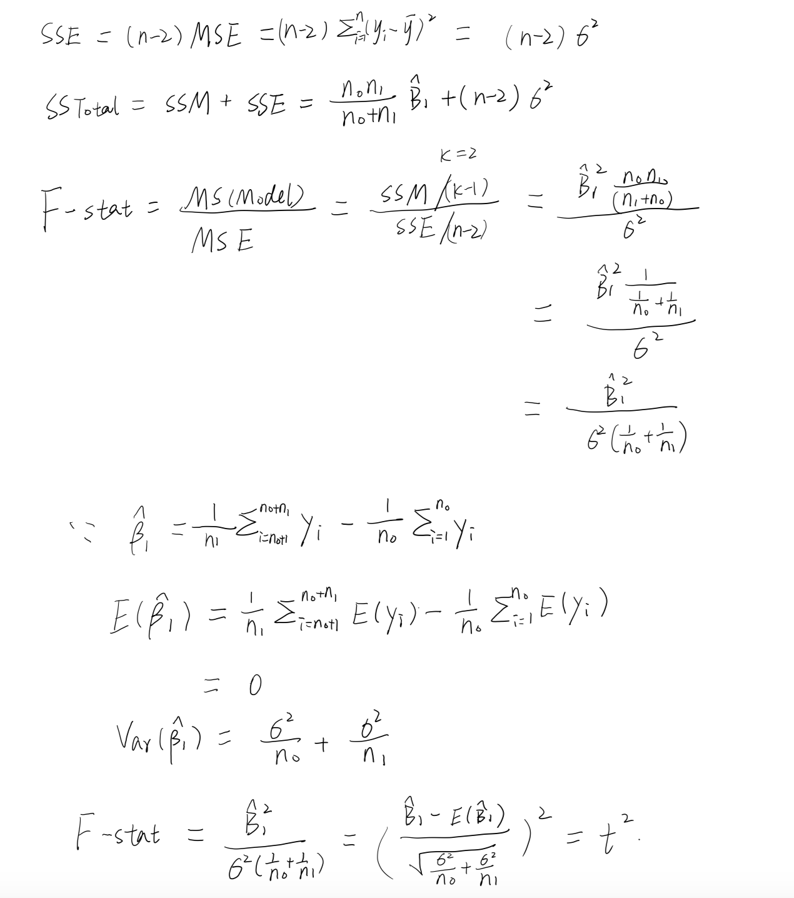
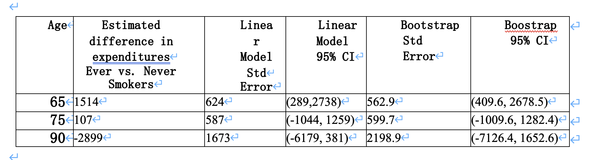

```{r setup, include=FALSE}
knitr::opts_chunk$set(echo = TRUE)
```

## I.Analysis of Variance

### 1.Link between two-sample t-test, linear regression and ANOVA.

#### a

a.Write out the model above using matrix notation and then using matrix calculations solve for the least squares estimates of , and . What is the estimate for HINT: You will show that the model above is the same as conducting a two-sample t-test, assuming the same variance in the intervention and placebo groups. The estimate of the intercept should be the sample mean in the placebo arm, the estimate of the slope should be the difference in the sample means comparing the intervention and control groups and the.

{width="500"}

{width="500"}


#### b

b.Fill in the ANOVA table for the two-sample t-test. Write the expressions for SS(Total), SS(Model) and SS(Error) using the correct combinations of and . Show that the F-statistic = (t-statistic)2


{width="500"}

{width="500"}


#### c

c.Using data from the NMES, perform an analysis comparing the mean total expenditures for 65 year old ever vs. never smokers using three methods: two-sample t-test, analysis of variance and a simple linear regression model.

```{r}
library(medicaldata)
library(tidyverse)
load("nmes.rdata")

d <- nmes |> 
  filter(lastage == 65) |> 
  filter(!is.na(lastage) & !is.na(totalexp) & !is.na(eversmk)) |>
  filter(eversmk != ".") |>
  arrange(lastage) |>
  mutate(ever = eversmk) 

# two-sample t-test
t_test <- t.test(totalexp~ever,data=d,var.equal=TRUE)
t_test
# analysis of variance
aov_summary <- summary(aov(totalexp ~ ever, data = d))
# simple linear regression
slm <- lm(totalexp ~ ever, data = d)
summary(slm)

```

iv. Compute the square root of the "mean squared error" from the analysis of variance table and compare this to the "residual standard error" output from the lm function. Are these the same or different?

```{r}
# square root of the “mean squared error”
sqrt(86972246)

sq_mse_aov <- sqrt(aov_summary[[1]]$'Mean Sq'[2]) 
rse_slm = summary(slm)$sigma
sq_mse_aov
rse_slm
```

iv. the square root of the "mean squared error" from the analysis of variance table is 9325.891. "residual standard error" output from the lm function is 9325.891. These two measures are the same. They both quantify the dispersion of the observed values around the fitted values.

```{=html}
<!-- -->
```
v.  Compare the (t-statistic)2 and F-statistics with corresponding p-values. Are these the same or different?

```{r}
t_stats <- t_test$statistic
t_squared <- t_stats*t_stats
print(paste("t-statistic2 from t-test:", t_squared))

f_statistic_lm <- summary(slm)$fstatistic["value"]
print(paste("F-statistic from lm:", f_statistic_lm))

p_value_ttest <- t_test$p.value
p_value_lm <- summary(slm)$coefficients[2,4] # p-value for the slope (ever)
print(paste("p-value from t-test:", p_value_ttest))
print(paste("p-value from lm:", p_value_lm))
```

(t-statistic)2 from the two-sample t-test is 4.38358. The F-statistic from the lm is 4.38358. These two results are the same.

P-value form the two-sample t-test is 0.03711, p-value from lm: 0.03711, these two results are the same.

### 2.Extend the ideas above to compare the mean total expenditures for 65 year old current, former and never smokers using two methods: analysis of variance and linear regression model.

```{r}
# reate a new variable X that is 0 = never smoker, 1 = former smoker, 2 = current smoker
d$X = ifelse(d$current=="1",2,
	ifelse(d$former=="1",1,
	ifelse(d$current=="." & d$former==".",NA,0)))
d = d[!is.na(d$X),]

# analysis of variance
summary(aov(totalexp~as.factor(X),data=d))
# linear regression
summary(lm(totalexp~as.factor(X),data=d))
```

#### iii. The linear regression model has an intercept and two slopes: $\beta_0$,$\beta_1$,$\beta_2$. Write out the definition of $\beta_0$,$\beta_1$,$\beta_2$ with respect to the group means $\mu_{never}$,$\mu_{former}$,$\mu_{current}$ Show that the null hypothesis: H_0:($\mu_{never}$)=$\mu_{former}$= $\mu_{current}$ is equivalent to H_0:$\beta_1$=0 and $\beta_2$=0.  

$\beta_0$ is the intercept, representing the mean total expenditure for the reference group, which in this case is the never smokers ($\mu_{never}$).\
$\beta_1$ represents the difference in mean total expenditure between former smokers and never smokers ($\mu_{former}$ - $\mu_{never}$).\
$\beta_2$ represents the difference in mean total expenditure between current smokers and never smokers ($\mu_{current}$ - $\mu_{never}$).

The equivalence of the two hypotheses: if $\beta_1$=0 and $\beta_2$=0, we could get $\mu_{former}$ - $\mu_{never}$ = 0 and $\mu_{current}$ - $\mu_{never}$ = 0; it implies that there is no difference in mean total expenditures between never smokers and the other two groups (former and current smokers), which equals to the ANOVA null hypothesis of equal mfeans across groups ($\mu_{never}$ = $\mu_{former}$ = $\mu_{current}$).

#### iv. Using the F-tests, what do you conclude regarding differences in the mean total expenditures for 65 year old current, former and never smokers?  

The F-test shows F-statistic is 2.351 on 2 and 297 DF, and p-value equals to 0.09701. We don't reject the null hypothesis, $\mu_{never}$ = $\mu_{former}$ = $\mu_{current}$. So the mean total expenditures for 65 year old current, former and never smokers are the same.

## II.Advanced Inferences for Linear Regression

```{r}
data1 <- nmes |> 
  filter(lastage >= 65) |> 
  filter(!is.na(lastage) & !is.na(totalexp) & !is.na(eversmk)) |>
  filter(eversmk != ".") |>
  arrange(lastage)
```

Fit a MLR of expenditures on age and smoking status as:

```{r}
data1 <- data1 |>
  mutate(
    age = lastage,
    agem65 = age - 65,
    age_sp1 = ifelse(age>=75, age -75, 0),
    age_sp2 = ifelse(age>=85, age-85, 0),
    ever = eversmk
         ) 

reg_1 <- lm(data = data1, totalexp~agem65 + age_sp1 + age_sp2 + ever + ever*(agem65 + age_sp1 + age_sp2))
summary(reg_1)

conf_intervals <- confint(reg_1, level=0.95)
print(conf_intervals)

```

### 1.Write a short, scientific interpretation of each coefficient in the model; use the estimated coefficient with corresponding confidence interval.

Intercept $\beta_0$: The estimated total medical expenditure for a adult at the age of 65 and never smoker is 2445.18 units with 95% confidence interval (1525.10, 3365.25).\
$\beta_1$ (agem65): For never-smokers adults aged 65 to 75 years, the estimated expenditure increases by 161.72 units (95%CI 17.86, 305.57) for every year increases.\
$\beta_2$ (age_sp1): For never smoker aged 75 to 85 years, the estimated expenditure decreases by 102.24 units (95%CI -378.54, 174.06) compared to never smoker aged 65 to 75 years.

$\beta_3$ (age_sp2): For never smoker aged 85 years and above, the estimated expenditure increases by 546.81 units (95%CI 42.93, 1050.68) compared to never smoker aged 75 to 85 years.

$\beta_4$ (ever1): Ever smokers have higher total expenditures by 1513.54 units (95%CI 289.23, 2737.85) compared to never smokers.

$\beta_5$ (agem65:ever1): The interaction term agem65:ever1 has a coefficient of -140.64 (95%CI 289.23, 55.63), which is not statistically significant (p \> 0.05). This means we do not have enough evidence to suggest that the effect of being an ever smoker on total expenditures is different for those aged 65 or older compared to younger individuals.

$\beta_6$ (age_sp1:ever1): The coefficient for the interaction age_sp1:ever1 is 261.66 (95%CI -142.96, 666.28), and it's not significant (p \> 0.05), suggesting no clear effect modification by ever smoking status in the aged 75 to 85 years group.

$\beta_7$ (age_sp2:ever1): The interaction suggests a decrease on total expenditures by 964.30 units (95%CI -1872.40, -56.19) for being an over 85 years ever smoker compared to the reference group (adults aged under 85 years and never-smoker).

### 2.Create a figure that displays the data and the predicted values from the fit of the MLR model from Question1.

```{r}
data1 <- data1 |>
  mutate(model1_pred = predict(reg_1))

plot1 <- data1 |>
  ggplot( aes(x = age, y = totalexp) ) +
  geom_jitter() + 
  geom_line(data = data1, aes( y = model1_pred,
                             x = age, color = as.factor(ever)),  linewidth = 1.5) +
  labs(y = "Total medical expenditure (Dollar)", x = "Age (in years)") +
  scale_y_continuous(breaks = seq(0, 15000, 1000), limits = c(0, 11000)) + 
  scale_x_continuous(breaks = seq(65, 95, 5), limits = c(65, 95))  +
  scale_color_manual(breaks=c("0","1"),
                     values=c("red","blue"),
                     labels = c("never smokers", "ever smokers"))

plot1
```

### 3.Using the model fit in Step 1 above, make a plot of the difference in mean expenditures between ever and never smokers as a function of age.

Difference \<- coef["ever1"] + coef["agem65:ever1"]*agem65 + coef["age_sp1:ever1"]*age_sp1 + coef["age_sp2:ever1"]\*age_sp2

```{r}
coef <- reg_1$coefficients
# to calculate the difference in expenditures between ever and never smokers
expenditure_difference <- function(age) {
  agem65 <- age - 65
  age_sp1 <- ifelse(age >= 75, age - 75, 0)
  age_sp2 <- ifelse(age >= 85, age - 85, 0)
  return(coef["ever1"] + coef["agem65:ever1"] * agem65 + coef["age_sp1:ever1"]  * age_sp1 + coef["age_sp2:ever1"]  * age_sp2)
}

# Create an age range from 65 to 94
age_range <- 65:94

# Calculate the difference for each age
differences <- sapply(age_range, expenditure_difference)

# Create a data frame for plotting
data_plot <- data.frame(Age = age_range, Difference = differences)

# Plotting using ggplot2
ggplot(data_plot, aes(x = Age, y = Difference)) +
  geom_line(color = "blue") +
  geom_hline(yintercept = 0, linetype = "dashed", color = "red") +
  labs(title = "Difference in Mean Expenditures Between Ever and Never Smokers by Age",
       x = "Age (Year)",
       y = "Difference in Expenditure (Dollars)") +
  theme_minimal()
```

Comment on why you think the average expenditures for ever smokers are less than the average expenditures for never smokers among persons over 85 years of age.

I think one potential reason is the survival bias. Old adults who ever smoking and still lived to over 85 years are more likely to be those who have healthy body, both genetic and physical level. So they use less medical expenditures compared to never smokers.

### 4.Use the appropriate linear combination of regression coefficients to calculate the estimated difference between ever and never smokers in average expenditures and its standard error at ages 65, 75, and 90 years. Complete the table below.

{width="500"}

```{r}
expenditure_difference(65)
expenditure_difference(75)
expenditure_difference(90)

reg1.vc = vcov(reg_1)

coef(reg_1)

# linear combination of betas
##### Age = 65
A = matrix(c(0,0,0,0,1,0,0,0), nrow = 1, ncol = 8)

A %*% coef 

A %*% reg1.vc %*% t(A)

# standard error
sqrt(A %*% reg1.vc %*% t(A))

# 95% CI for beta
A %*% coef - qt(0.975, df=summary(reg_1)$df[2]) * sqrt(A %*% reg1.vc %*% t(A))

A %*% coef + qt(0.975, df=summary(reg_1)$df[2]) * sqrt(A %*% reg1.vc %*% t(A))


#### Age = 75
A = matrix(c(0,0,0,0,1,10,0,0), nrow = 1, ncol = 8)

A %*% coef 

A %*% reg1.vc %*% t(A)

# standard error
sqrt(A %*% reg1.vc %*% t(A))

# 95% CI for beta
A %*% coef - qt(0.975, df=summary(reg_1)$df[2]) * sqrt(A %*% reg1.vc %*% t(A))

A %*% coef + qt(0.975, df=summary(reg_1)$df[2]) * sqrt(A %*% reg1.vc %*% t(A))


#### Age = 90
A = matrix(c(0,0,0,0,1,25,15,5), nrow = 1, ncol = 8)

A %*% coef 

A %*% reg1.vc %*% t(A)

# standard error
sqrt(A %*% reg1.vc %*% t(A))

# 95% CI for beta 
A %*% coef - qt(0.975, df=summary(reg_1)$df[2]) * sqrt(A %*% reg1.vc %*% t(A))

A %*% coef + qt(0.975, df=summary(reg_1)$df[2]) * sqrt(A %*% reg1.vc %*% t(A))

```

### 5.Now estimate the ratio of the average expenditures comparing ever to never smokers at age 65. This is a non-linear function of the regression coefficients from step 1. Use the delta method to estimate the standard error of this statistic and make a 95% confidence interval for the true value given the model.

```{r}
# # ratio of the average expenditures comparing ever to never smokers
# expenditure_ratio <- function(age) {
#   agem65 <- age - 65
#   age_sp1 <- ifelse(age >= 75, age - 75, 0)
#   age_sp2 <- ifelse(age >= 85, age - 85, 0)
#   return(1 + (coef["ever1"] + coef["agem65:ever1"] * agem65 + coef["age_sp1:ever1"]  * age_sp1 + coef["age_sp2:ever1"]  * age_sp2)/(coef["(Intercept)"] +coef["agem65"]*agem65 + coef["age_sp1"] * age_sp1+ coef["age_sp2"]* age_sp2 ) )
# }
# 
# # Create an age range from 65 to 94
# age_range <- 65:94
# ratio <- sapply(age_range, expenditure_ratio)
# 
# ratio_at_65 <- expenditure_ratio(65)
# ratio_at_65
# # estimate the standard error 
# reg1.vc = vcov(reg_1)
# 
# library(numDeriv)
# # Calculate the gradient at the coefficients
# grad <- grad(expenditure_ratio, coef)
# 
# # Calculate the variance using the delta method
# var_ratio <- t(grad) %*% reg1.vc %*% grad
# 
# se_ratio <- sqrt(var_ratio)
# se_ratio
# # 95% confidence interval 
# ratio_at_65 - qt(0.975, df=summary(reg_1)$df[2]) * sqrt(var_ratio)
# 
# ratio_at_65 + qt(0.975, df=summary(reg_1)$df[2]) * sqrt(var_ratio)


model_21 = lm(totalexp ~ agem65 + age_sp1 + age_sp2 + ever + ever*(agem65 + age_sp1 + age_sp2), data1)
ratio_pt = 1 + coef(model_21)[5]/coef(model_21)[1] 
coef_21 = coef(model_21)
model_21_vcov = vcov(model_21)
ratio_gprime <-
  matrix(c(-coef_21[5] / coef_21[1]^2, 0, 0, 0, 1 / coef_21[1], 0, 0, 0),
         nrow = 1,
         ncol = 8)

ratio_se <- sqrt(ratio_gprime %*% model_21_vcov %*% t(ratio_gprime)) 
ratio_ci <- ratio_pt + c(-1,1)*qt(0.975,df=summary(model_21)$df[2])*ratio_se
ratio_ci <- ratio_pt + c(-1,1)*qnorm(0.975)*ratio_se
## Generate a 95% CI for the ratio
print(paste(c(round(ratio_pt,3), ' 95%CI:', round(ratio_ci,3)), collapse = ' '))
```

Use the delta method, the ratio of the average expenditures comparing ever to never smokers at age 65 is 1.619 with 95% CI (0.926 2.312). The Standard error of this statistic is 0.3534826.

### 6.use the bootstrap procedure to estimate the standard errors and confidence intervals for the difference in Question 4.

#### Bootstrap Std Error

```{r boot Q4, message=FALSE, warning=FALSE}
# Set seed
set.seed(653)
library(boot)

# Define a function to calculate the difference in expenditures
difference_calc <- function(data, indices, age) {
  # Ensure the data is correctly sampled
  resample <- data[indices, ]
  
  # Calculate the age terms for the specified age
  agem65 <- age - 65
  age_sp1 <- ifelse(age >= 75, age - 75, 0)
  age_sp2 <- ifelse(age >= 85, age - 85, 0)
  
  # Fit the model on the sampled data
  fit <- lm(totalexp ~ agem65 + age_sp1 + age_sp2 + ever + ever*(agem65 + age_sp1 + age_sp2), data = resample)
  
  # Calculate the difference using the model coefficients
  coef_fit <- coef(fit)
  difference <- coef_fit["ever1"] + 
                coef_fit["agem65:ever1"] * agem65 + 
                coef_fit["age_sp1:ever1"] * age_sp1 + 
                coef_fit["age_sp2:ever1"] * age_sp2
  
  return(difference)
}

```

```{r}
# Perform the bootstrap for each age
results <- lapply(c(65, 75, 90), function(age) {
  boot(data1, difference_calc, R = 1000, age = age)
})

# Extract the bootstrap standard errors and confidence intervals
bootstrap_results <- sapply(results, function(b) {
  se <- boot.ci(b, type = "perc")
  return(c(Estimate = mean(b$t), SE = sd(b$t), CI_lower = se$percent[4], CI_upper = se$percent[5]))
})

# Combine the results into a data frame
bootstrap_results_df <- as.data.frame(t(bootstrap_results))
names(bootstrap_results_df) <- c("Estimate", "SE", "CI_lower", "CI_upper")
row.names(bootstrap_results_df) <- c("Age 65", "Age 75", "Age 90")

# Print the results
print(bootstrap_results_df)

```

The bootstrapped std error and 95% CI of estimated difference between ever and never smokers in average expenditures for people aged 65 is similar to the model-based std error and 95% CI. For people aged 75 and 90, the estimated difference between ever and never smokers have bigger bootstrapped std error and wider bootstrapped 95% CI than the model-based one.

### 6b.use the bootstrap procedure to estimate the standard errors and confidence intervals for the ratio in Question 5.

```{r boot Q5, message=FALSE, warning=FALSE}
set.seed(653)

ratio_boot <- function(data, indices, age) {
  # Ensure the data is correctly sampled
  resample <- data[indices, ]
  
  # Calculate the age terms for the specified age
  agem65 <- age - 65
  age_sp1 <- ifelse(age >= 75, age - 75, 0)
  age_sp2 <- ifelse(age >= 85, age - 85, 0)
  
  # Fit the model on the sampled data
  fit <- lm(totalexp ~ agem65 + age_sp1 + age_sp2 + ever + ever*(agem65 + age_sp1 + age_sp2), data = resample)
  
  # Calculate the difference using the model coefficients
  coef <- coef(fit)
  ratio <- 1 + (coef["ever1"] + coef["agem65:ever1"] * agem65 + coef["age_sp1:ever1"]  * age_sp1 + coef["age_sp2:ever1"]  * age_sp2)/(coef["(Intercept)"] +coef["agem65"]*agem65 + coef["age_sp1"] * age_sp1+ coef["age_sp2"]* age_sp2 )
  return(ratio)
}

```

```{r}
# Perform the bootstrap for each age
results_2 <- lapply(c(65, 75, 90), function(age) {
  boot(data1, ratio_boot, R = 1000, age = age)
})


# Extract the bootstrap standard errors and confidence intervals
bootstrap_results <- sapply(results_2, function(b) {
  se <- boot.ci(b, type = "perc")
  return(c(Estimate = mean(b$t), SE = sd(b$t), CI_lower = se$percent[4], CI_upper = se$percent[5]))
})

# Combine the results into a data frame
bootstrap_results_df <- as.data.frame(t(bootstrap_results))
names(bootstrap_results_df) <- c("Estimate", "SE", "CI_lower", "CI_upper")
row.names(bootstrap_results_df) <- c("Age 65", "Age 75", "Age 90")

# Print the results
print(bootstrap_results_df)


```

Using bootstrapping, the ratio of the average expenditures comparing ever to never smokers at age 65 is 1.659 (95% CI 1.143, 2.323), the standard errors for the ratio is 0.291. Compared with results obtained directly from the linear regression, the bootstrapped 95% CI is wider than the model-based one, the bootstrapped standard error is larger than the model-based one.

### 7.Test the null hypothesis that on average, ever and never smokers use the same quantity of medical services; i.e. are the mean expenditures at any age the same for ever and never smokers?

`Likelihood Ratio Test`

```{r}
# install.packages("lmtest")
library(lmtest)

null_model <- lm(totalexp ~ agem65 + age_sp1 + age_sp2, data = data1) # null model (without ever or its interactions)
extended_model <- lm(totalexp ~ agem65 + age_sp1 + age_sp2 + ever + ever*(agem65 + age_sp1 + age_sp2), data = data1) # extended model (with ever and interactions)

# Likelihood ratio test
lr.test.stat = as.numeric(2*logLik(extended_model)-2*logLik(null_model))
pchisq(lr.test.stat, df=4, lower.tail = FALSE) # 0.0152

lrtest(null_model, extended_model) # 0.0152 

# F-test
anova(null_model, extended_model) # F = 3.076, P-value =  0.01532 

```

H0: $\beta_4=0$, $\beta_5=0$, $\beta_6=0$, $\beta_7=0$, $\beta_8=0$ H1: at least one not equal to 0 The likelihood ratio test shows the p-value = 0.0152, which is less than 0.05. We reject the null hypothesis, indicating that the mean expenditures are different for ever and never smokers at any age. The F test also shows the p-value = 0.0153, F stat = 3.076. The result indicates the full model is better than the null model. It suggests that ever and never smokers use the different quantity of medical services, and varies with age. The results of likelihood ratio test and F test are similar, suggests that smoking status significantly affects medical expenditures, and this effect varies with age.

### 8.Using the results of Questions 1-7, write a brief report with sections: Objective, data, methods, results, and discussion as if for a health services journal.

`Objective`: To explore whether older adults aged 65 above ever and never smokers of the same age use roughly the same quantity of medical services.  
`Data`: The study used 1987 National Medical Expenditure Survey (NMES) dataset, including 13648 study participants.  
`Methods`: We conducted multiple linear regression (MLR) allowing the total medical expenditures to change as a function of age (linear spline with knot at 75 and 85 years), separately for ever and never smokers. To address data skewness and heteroscedasticity, we applied the delta method, bootstrapping for robust standard error estimation, and conducted likelihood ratio and F-tests to test whether mean expenditures differ between ever and never smokers.  
`Results`: The regression analysis indicates that at age 65, never smokers have an estimated mean total medical expenditure of 2,445.18 dollars, while ever smokers have higher medical expenditure of 3,958.72 dollars. The difference in costs between ever and never smokers at age 65 is 1,513.54 dollars with 95% confidence interval (289.23 to 2,737.85).  For ages 75 and 90, the differences in projected costs between the two groups are 107.14 and -2,899.06, respectively, but these are not statistically significant as their confidence intervals include zero. The expenditure ratio for ever versus never smokers at age 65 is approximately 1.62, with a 95% confidence interval of 0.926 to 2.312, confirming higher costs for ever smokers. Statistical tests yield a p-value of 0.015, indicating a significant difference in medical expenditures between the groups across all ages analyzed.
`Discussions`: Our findings suggest that age has association with total medical expenditures, with this effect varying by somking status The use of advanced statistical methods, including bootstrapping, provided a more nuanced understanding of the expenditure patterns, accounting for the data's non-normal distribution and heteroscedasticity. The study underscores the economic impact of smoking on healthcare costs and highlights the importance to understand these effects accurately.


## III. Estimating rates of change from smooth functions

### 1.Describe in words what as a function of age looks like for a linear spline with knots at 75 and 85 years.

The slope(age) as a function of age for a linear spline with knots at 75 and 85 years equals to three constant at different age range, and changes at these knot points. From ages 65 to 75, the slope(age) is constant $\beta_1$; from ages 75 to 85, the slope(age) is constant $\beta_1$+$\beta_2$; from ages 85 to 95, the slope(age) is constant $\beta_1$+$\beta_2$+$\beta_3$.

### 2.Apply the procedure described above to estimate for a cubic spline model.

a.Subset the data you used in Part II to include only the ever smokers. Fit a cubic spline model with knots at 75 and 85 years of age to the data for the ever smokers. Save the estimated regression coefficients and variance matrix for the estimated regression coefficients.

```{r}
data_ever <- data1 |>
  filter(ever == 1) |>
  mutate(
          age2 = (age-65) * (age-65) ,
          age3 = (age-65) * (age-65) * (age-65) ,
          age_csp1 = ifelse(age-75>0, (age-75)^3,0),
          age_csp2 = ifelse(age-85>0, (age-85)^3,0),
          )

reg_cubic <- lm(data = data_ever, totalexp ~ agem65 + age2 + age3 + age_csp1 + age_csp2)
summary(reg_cubic)

coef_cubic <- reg_cubic$coefficients
var_cubic <- vcov(reg_cubic)
```

b.For ages, in years, 65 to 94, derive and create and compute and slope(age) and var(slope(age)).

```{r}
# dXage <- matrix(c(0,1,2*(age-65),3*(age-65)^2, 3*(age-75)^2, 3*(age-85)^2), )
ages <- 65:94
dX <- data.frame(
  Intercept = rep(0, length(ages)),
  Linear = rep(1, length(ages)),
  Quadratic = 2 * (ages - 65),
  Cubic = 3 * (ages - 65)^2,
  Spline1 = 3 * ifelse(ages > 75, (ages - 75)^2, 0),
  Spline2 = 3 * ifelse(ages > 85, (ages - 85)^2, 0)
)

# Compute estimated slopes
slope_hat <- as.matrix(dX) %*% coef_cubic

# Compute variance of the slope estimates
var_slope_hat <- diag(as.matrix(dX) %*% var_cubic %*% t(as.matrix(dX)))

# Standard error of the slopes
se_slope_hat <- sqrt(var_slope_hat)

# 95% CI for the slopes
ci_lower <- slope_hat - 1.96 * se_slope_hat
ci_upper <- slope_hat + 1.96 * se_slope_hat

# Results
slopes_df <- data.frame(Age = ages, Slope = slope_hat, SE = se_slope_hat, CI_Lower = ci_lower, CI_Upper = ci_upper)

slopes_df
```

c.Make a two panel figure displaying E(total expenditures) vs. age and slope(age) vs. age (with corresponding 95% confidence intervals).

```{r}
ages <- 65:94
new_data <- data.frame(age = ages)
# Add columns for the cubic spline terms
new_data$agem65 <- new_data$age - 65
new_data$age2 <- (new_data$age - 65)^2
new_data$age3 <- (new_data$age - 65)^3
new_data$age_csp1 <- ifelse(new_data$age - 75 > 0, (new_data$age - 75)^3, 0)
new_data$age_csp2 <- ifelse(new_data$age - 85 > 0, (new_data$age - 85)^3, 0)

# Predict E(total expenditures) using the cubic spline model
new_data$predicted_totalexp <- predict(reg_cubic, newdata = new_data)

# data_ever <- data_ever |> 
#   mutate(predicted_totalexp = predict(reg_cubic, newdata = data_ever))

p1 <- new_data |>
  ggplot(aes(x=age, y=predicted_totalexp)) +
  geom_line(color = "blue") +
  labs(title = "Expected Total Expenditures vs. Age (Ever smoker)", x = "Age (Year)", y = "Expected Total Expenditures (Dollar)")

p2 <- slopes_df |>
  ggplot(aes(x=Age, y=Slope)) +
  geom_line(color = "red") +
  geom_ribbon(aes(ymin = CI_Lower, ymax = CI_Upper), alpha = 0.2) +
  labs(title = "Estimated Slope of Expenditures vs. Age (Ever smoker)", x = "Age", y = "Estimated Slope")

# Use the 'patchwork' library to combine plots
library(patchwork)
combined_plot <- p1 + p2 + plot_layout(ncol = 1)
print(combined_plot)
```

### 3.Next, we will utilize the splines2 package in R to help us generate to estimate slope(age) for a natural cubic spline model with knots at 75 and 85 years. Install the splines2 package if not already done so and include library(splines2) in your R code.

```{r}
# install.packages("splines2")
library(splines2)
```

a.Fit the natural cubic spline model with knots at 75 and 85 years and save the coefficients and variance of the estimated coefficients.

fit = lm(totalexp\~-1 + nsp(lastage,knots=c(75,85),intercept=TRUE),data=data.ever) fit.coeff = fit\$coefficients V.coeff = vcov(fit)

```{r}
fit = lm(totalexp~-1 + nsp(lastage,knots=c(75,85),intercept=TRUE),data=data_ever)
fit.coeff = fit$coefficients
V.coeff = vcov(fit)

```

b.Generate the design matrix X and derivative of the design matrix, , evaluated at ages 65 through 94, and the estimated E(total expenditures) and for ages 65 through 94.

```{r}
# First create the design matrix and derivative of the design matrix
X = naturalSpline(seq(65,94),knots=c(75,85),intercept=TRUE)
dXage = naturalSpline(seq(65,94),knots=c(75,85),intercept=TRUE,derivs=1)

# Estimate E(total expenditures) and slope(age) for ages 65 to 94
mean.Y.age = predict(X,coef=fit.coeff)
slope.age = predict(dXage,coef=fit.coeff)
```

c.Compute the and create a two panel figure displaying E(total expenditures) and for ages 65 to 94 for ever smokers.

NOTE: the variance is: diag(dXage %*% V.coeff %*% t(dXage))

```{r}
# Compute variance of the slope estimates
var_slope.age <- diag(dXage %*% V.coeff %*% t(dXage)) 

# Standard error of the slopes
se_slope_age <- sqrt(var_slope.age)

# 95% CI for the slopes
ci_lower <- slope.age - 1.96 * se_slope_age
ci_upper <- slope.age + 1.96 * se_slope_age

# Results
slopes_ns <- data.frame(Age = ages, Estimate = mean.Y.age, Slope = slope.age, SE = se_slope_age, CI_Lower = ci_lower, CI_Upper = ci_upper)

slopes_ns
```

```{r}
p3 <- slopes_ns |>
  ggplot(aes(x=Age, y=Estimate)) +
  geom_line(color = "blue") +
  labs(title = "Expected Total Expenditures vs. Age (Ever smoker)", x = "Age (Year)", y = "Expected Total Expenditures (Dollar)")

p4 <- slopes_ns |>
  ggplot(aes(x=Age, y=Slope)) +
  geom_line(color = "red") +
  geom_ribbon(aes(ymin = CI_Lower, ymax = CI_Upper), alpha = 0.2) +
  labs(title = "Estimated Slope of Expenditures vs. Age (Ever smoker)", x = "Age", y = "Estimated Slope")

combined_plot2 <- p3 + p4 + plot_layout(ncol = 1)
print(combined_plot2)
```

d.Repeat the process above for never smokers and create a final two panel figure with E(total expenditures) and for ages 65 to 94 separately for ever and never smokers. Include confidence intervals for .

```{r}
data_never <- data1 |>
  filter(ever == 0) |>
  mutate(
          age2 = (age-65) * (age-65) ,
          age3 = (age-65) * (age-65) * (age-65) ,
          age_csp1 = ifelse(age-75>0, (age-75)^3,0),
          age_csp2 = ifelse(age-85>0, (age-85)^3,0),
          )
fit = lm(totalexp~-1 + nsp(lastage,knots=c(75,85),intercept=TRUE),data=data_never)
fit.coeff = fit$coefficients
V.coeff = vcov(fit)

# First create the design matrix and derivative of the design matrix
X = naturalSpline(seq(65,94),knots=c(75,85),intercept=TRUE)
dXage = naturalSpline(seq(65,94),knots=c(75,85),intercept=TRUE,derivs=1)

# Estimate E(total expenditures) and slope(age) for ages 65 to 94
mean.Y.age = predict(X,coef=fit.coeff)
slope.age = predict(dXage,coef=fit.coeff)

# Compute variance of the slope estimates
var_slope.age <- diag(dXage %*% V.coeff %*% t(dXage)) 

# Standard error of the slopes
se_slope_age <- sqrt(var_slope.age)

# 95% CI for the slopes
ci_lower <- slope.age - 1.96 * se_slope_age
ci_upper <- slope.age + 1.96 * se_slope_age

# Results
slopes_ns2 <- data.frame(Age = ages, Estimate = mean.Y.age, Slope = slope.age, SE = se_slope_age, CI_Lower = ci_lower, CI_Upper = ci_upper)

slopes_ns2
```

```{r}
p5 <- slopes_ns2 |>
  ggplot(aes(x=Age, y=Estimate)) +
  geom_line(color = "blue") +
  labs(title = "Expected Total Expenditures vs. Age (Never smoker)", x = "Age (Year)", y = "Expected Total Expenditures (Dollar)")

p6 <- slopes_ns2 |>
  ggplot(aes(x=Age, y=Slope)) +
  geom_line(color = "red") +
  geom_ribbon(aes(ymin = CI_Lower, ymax = CI_Upper), alpha = 0.2) +
  labs(title = "Estimated Slope of Expenditures vs. Age (Never smoker)", x = "Age", y = "Estimated Slope")

combined_plot2 <- p5 + p6 + plot_layout(ncol = 1)
print(combined_plot2)
```

```{r}
combined_plot3 <- p4 + p6 + plot_layout(ncol = 1)
print(combined_plot3)
```

e.In two or three sentences, describe the different patterns you observe in how E(total expenditures) change with age, i.e. , for both ever and never smokers.

For ever smoker, the estimated total expenditures decreases with age when adults aged 65-75 years, then the estimated total expenditures increases with age when adults aged 75-85 years, and then the estimated total expenditures decreases with age when adults aged 85-95 years.

For never smokers, the estimated total expenditures consistently increases with age, implying that expenditures continue to grow as age increased.

This indicates a different pattern where the relationship between age and medical expenditures is more consistent and linear for never smokers, while for ever smokers, it's non-linear with a peak in the rate of change at 85 ages.
