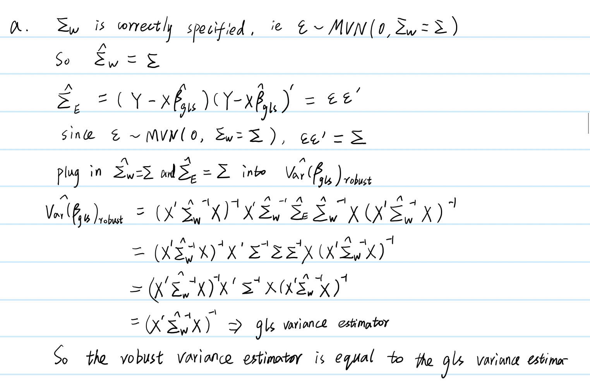
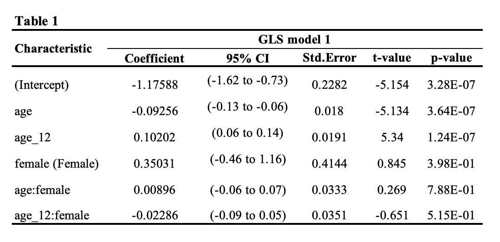
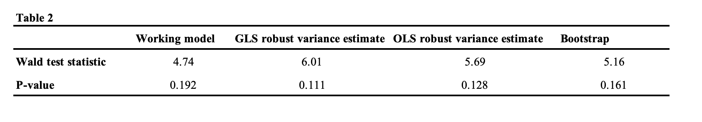

```{r load packages, warning=FALSE, message=FALSE}
knitr::opts_chunk$set(warning = FALSE)
library(nlme)
library(tidyverse)
library(gee)
library(lmtest)
library(splines)
library(ggplot2)
library(gridExtra)
library(dplyr)
library(boot)

options(digits = 3)
```

# Part I: Get familiar with the data

### Load the data and create the parity variable

1.Read in the Nepal study data, keep only the necessary variables, create the weight-for-age z-scores and indicator for female sex and exclude visits with missing weight-for-age z-scores or where children are over 60 months of age.

```{r}
load("nepal.anthro.rdata")
d0 = nepal.anthro[,c("id", "alive", "age", "wt","fuvisit","sex")]
d0$female = factor(ifelse(d0$sex==2,1,0),levels=0:1,labels=c("Male","Female"))
# install.packages("anthro")
library(anthro)
zscores = with(d0,anthro_zscores(sex = sex, age = age,weight = wt,is_age_in_month=TRUE))$zwei
d = cbind(d0,zscores)[complete.cases(d0) & d0$age<=60,]
d_clean <- d |>
   filter(!is.na(zscores) | zscores != '' )

summary(d_clean$zscores)
```

### 2.Identify the number of children in the sample, overall and for each sex.

```{r}
# number of children in the sample
n_distinct(d_clean$id)    #1: How many distinct participants? 195

# Number of children by sex
n_child_sex = d_clean %>%
 group_by(female) %>%
 summarise(num_children = n_distinct(id))

n_child_sex
```

#### Calculate the number of visits for each child with non-missing weight-for-age z-scores and compute the average and quartiles of the number of visits for each child by sex.

```{r}
# number of visits for each child with non-missing z-scores 
visits_per_child <- aggregate(zscores ~ id, data=d_clean, function(x) sum(!is.na(x)))
names(visits_per_child) <- c("id", "num_visits")
visits_per_child
```

# Compute Average and Quartiles of the Number of Visits for Each Child by Sex:

```{r}
# Calculate the number of visits for each child with non-missing z-scores
visits_per_child_sex <- aggregate(fuvisit ~ id + sex, data=d_clean, FUN=length)

# Calculate the average number of visits by sex
average_visits_by_sex <- aggregate(fuvisit ~ sex, data=visits_per_child_sex, FUN=mean)

# Calculate the quartiles of the number of visits by sex
quartiles_visits_by_sex <- aggregate(fuvisit ~ sex, data=visits_per_child_sex, FUN=function(x) quantile(x, probs=c(0.25, 0.5, 0.75)))

colnames(average_visits_by_sex) <- c("Sex", "Average Visits")
colnames(quartiles_visits_by_sex) <- c("Sex", "Quartiles of Visits")

print(average_visits_by_sex)
print(quartiles_visits_by_sex)
```

The average of the number of visits is 3.86 for female, and 3.76 for male.

### 3.Make a spaghetti plot of children's weight-for-age z-scores as a function of age; connecting the measured weights within a child over time. Color code the data by sex. Add smoothing splines for each sex. Note any similarities or differences in the growth rates across the groups.

```{r, warning=FALSE}
# Create custom theme
custom_theme <- theme(
  panel.background = element_blank(),
  axis.ticks = element_blank(),
  axis.text = element_text(size = 12),
  axis.title = element_text(size = 12, face = "bold"),
  axis.line = element_line(size = 0.5),
  plot.title = element_text(size = 14, face = "bold", hjust = 0.5)
)

# Spaghetti plot of whole mouth average gingival index
spagplot <- d_clean |>
  ggplot() +
  geom_line(aes(x = age, y = zscores, group = factor(id), color = female), linewidth = 1, alpha = 0.5) +
  geom_smooth(aes(x = age, y = zscores, color = female), method = "loess", se = FALSE) +
  # scale_x_discrete(labels = c("Baseline (1)", "3", "5")) +
  labs(x = "Age (Months)", y = "Weight-for-age z-scores", color = "Sex") +
  scale_x_continuous(breaks = seq(0,60,10),limits = c(0,60)) +
  custom_theme
spagplot
```

We could see a increase trend in weight-for-age z-scores as age increases in male. We could see a decreasing and then increasing trend of weight-for-age z-scores as age increases in female

# Part II: Model checking and recommendations

```{r}
model1 <- lm(zscores ~ age + female + age*female, data = d_clean )
summary(model1)
```

### 1.Conduct appropriate checking of this model; i.e. check for appropriateness of the mean model, and the independence and constant variance assumptions for the residuals.

#### assumption E(Y \|X) = X $\beta$

```{r}
d_clean$residuals = residuals(model1)
ggplot(d_clean,aes(x=age, y=residuals)) +
    geom_jitter(alpha = 0.7) +
    theme_bw() +
    geom_smooth() +
    geom_hline(yintercept=0,color="red") +
    labs(y="Residuals: linear age",x="Age in months") +
    scale_y_continuous(breaks=seq(-3.5,3.5,0.5),limits=c(-3.5,3.5)) +
  scale_x_continuous(breaks=seq(0,60,6),limits=c(0,60))
```

#### Independence assumption

Visualizing autocorrelation using a scatterplot matrix

```{r}
# Retrieve only the zscores, age, and Model 1
d_wide <- d_clean |>
  select(residuals, fuvisit, id) |>
  pivot_wider(id_cols = "id",
              names_from = "fuvisit",
              values_from = "residuals")

d_wide <- d_wide |>
  filter(complete.cases(d_wide))

# View the wide data
head(d_wide, n = 3)

# Use wide format of the data
cor(d_wide[,c(2:6)])
pairs(d_wide[,c(2:6)])
```

The model for the variance is a function of the visits.

```{r}
# Autocorrelation function
autocorr_fit1 <- gls(zscores ~ age + female + age*female, data = d_clean)
# Run autocorrelation function
# The form argument follows ~ 1 (meaning no covariate) then indicate the ID variable of the individual
ACF(autocorr_fit1, form = ~   1 | id )

```

#### constant variance assumptions for the residuals

```{r}
d_clean = mutate(d_clean, r2 = residuals^2)
# Scatterplot of log squared residuals by age,
# ggplot(d_clean,aes(x=age, y=r2, group = female, color = female)) +
#     geom_jitter(alpha = 0.5) +
#     theme_bw() +
#     geom_smooth() +
#     labs(y="Squared residuasl",x="Age (in months)", color = "Sex")
ggplot(d_clean,aes(x=age, y=r2 )) +
    geom_jitter(alpha = 0.5) +
    theme_bw() +
    geom_smooth() +
    labs(y="Squared residuasl",x="Age (in months)" )
```

```{r}
ggplot(d_clean,aes(x=age, y=r2 , group = female, color = female)) +
    geom_jitter(alpha = 0.5) +
    theme_bw() +
    geom_smooth() +
    labs(y="Squared residuasl",x="Age (in months)" , color = "Sex" )
```

The variation in the residuals for the female children look roughly the same over the age. There appears to be a reduction in the variance of the residuals as age increased to 12 months for male children. So we can propose to modify our multiple linear regression model to relax the homoskedasticity assumption and propose a variance model that is a function of age.

For example our model may be:\
Var($\epsilon_{ij}$)=$\gamma_0$+$\gamma_1$\|(age-12)\|(sex = male)

#### Residual are normally distributed

```{r}
qqnorm(model1$residuals) 
qqline(model1$residuals, col="red")
```

### 2.Based on your model checking, propose an alternative model for the data that can address the first goal of the analysis, i.e. determine if the growth rates of children differ by sex while satisfying the observed patterns in data with respect to the mean model and distribution of residuals. NOTE: If you modify the mean model, you may want to iterate between model checking for the mean.

Based on the model checking, we could see the mean model is not very suitable to examine if the growth rate of children differ by sex. When children from birth to 12 months, the residual is not equal to 0. So I add a spline term for age with knot at 12 months and an interaction for age_12 with female.

$Y_{zscores} = age + (age-12)^+ + Female + age * Female + (age-12)^+ * Female + \epsilon$

```{r}
d_clean <- d_clean |>
  mutate(age_12 = ifelse(age-12>0, age -12, 0))

model2 <- lm(zscores~ age + age_12 + female + age*female + age_12*female, data = d_clean)
```

#### assumption E(Y \|X) = X $\beta$

checking the mean:

```{r}
d_clean$residuals2 = residuals(model2)
ggplot(d_clean,aes(x=age, y=residuals2)) +
    geom_jitter(alpha = 0.7) +
    theme_bw() +
    geom_smooth() +
    geom_hline(yintercept=0,color="red") +
    labs(y="Residuals: linear spline age",x="Age in months") +
    scale_y_continuous(breaks=seq(-3.5,3.5,0.5),limits=c(-3.5,3.5)) +
  scale_x_continuous(breaks=seq(0,60,6),limits=c(0,60))
```

We could see the residuals have a mean of zero across the age in months, indicating the linear spline regression model with a knot at age 12 months and interaction terms with sex is a better mean model than the previous one.

#### Independence assumption

Visualizing autocorrelation using a scatterplot matrix

```{r}
# Retrieve only the zscores, age, and Model 1
d_wide2 <- d_clean |>
  select(residuals2, fuvisit, id) |>
  pivot_wider(id_cols = "id",
              names_from = "fuvisit",
              values_from = "residuals2")

d_wide2 <- d_wide2 |>
  filter(complete.cases(d_wide2))

# View the wide data
head(d_wide2, n = 3)

# Use wide format of the data
cor(d_wide2[,c(2:6)])
pairs(d_wide2[,c(2:6)])
```

The model for the variance is a function of the visits.

```{r}
# Autocorrelation function
autocorr_fit2 <- gls(zscores ~ age + age_12 + female + age*female + age_12*female, data = d_clean)
# Run autocorrelation function
# The form argument follows ~ 1 (meaning no covariate) then indicate the ID variable of the individual
ACF(autocorr_fit2, form = ~   1 | id )

```

#### constant variance assumptions for the residuals

```{r}
d_clean = mutate(d_clean, r2_new = residuals2^2)
# Scatterplot of log squared residuals by age,
ggplot(d_clean,aes(x=age, y=r2_new, group = female, color = female)) +
    geom_jitter(alpha = 0.5) +
    theme_bw() +
    geom_smooth() +
    labs(y="Squared residuasl",x="Age (in months)", color = "Sex")

```

#### resicual are normally distributed

```{r}
qqnorm(model2$residuals) 
qqline(model2$residuals, col="red")
```

# Part III: Marginal model for longitudinal data

### 1.Use the gls function in R to fit the model you proposed in Part I.

```{r}
# AR(1): 
model_AR <- gls(zscores ~age + age_12 + female + age*female + age_12*female, data = d_clean, correlation = corAR1(form= ~fuvisit|id), weights = varFunc(~as.numeric(female)))
summary(model_AR)$tTable
confint(model_AR)

# # Toeplitz: 
# model_Toep <- gls(zscores ~age + age_12 + female + age*female + age_12*female, data = d_clean, correlation = corARMA(form= ~fuvisit|id, p=4, q=0))
# summary(model_Toep)$tTable

```

### 2.From the fit of the model, compute the estimated Corr($\epsilon_{i1}$, $\epsilon_{ij}$) for j = 2, 3, 4, 5 where the follow-up visits (fuvisit) have values 0 (baseline, j=1) and 1, 2, 3, 4 (representing the 4 follow-up visits each 4 months apart,j = 2, 3, 4, 5). Compare these model-based correlation estimates to those you computed in Part II Question1.

```{r}
# AR(1): 
female.V = getVarCov(model_AR, individual=3)
cov2cor(female.V)
male.V = getVarCov(model_AR,individual=7)
cov2cor(male.V)

# Toeplitz: 
# getVarCov(model_Toep, individual=1)
# round(cov2cor(getVarCov(model_Toep, individual=1)),3)
```

For time point 1 (baseline, j=1) to time point 2 (j=2), the AR(1) model estimates correlation of 0.912, while the previously computed correlation was 0.904. For time point 1 (baseline, j=1) to time point 3 (j=3), the AR(1) model estimates the correlation as 0.831, in comparison to the previously one 0.883. Correlation between time point 1 and 4 was 0.758 in AR(1) model, and 0.836 in previous model. This AR(1) model provides a more smooth decrease in correlation over time, which is characteristic of the exponential decay pattern typical of AR(1) processes.

### 3. Conduct a Wald test to address the overall goal of the analysis; i.e. to determine if the average growth rates of children differ by sex.

```{r}
library(nlme)

# Extract estimated regression coefficients
beta_hat <- coef(model_AR)

# estimated variance of $\beta_hat$ 
V_beta_hat <- summary(model_AR)$varBeta

C <- matrix(c(0, 0, 0, 1, 0, 0,   # for female
              0, 0, 0, 0, 1, 0,   # for age:female
              0, 0, 0, 0, 0, 1),  # for age_12:female
            nrow = 3, byrow = TRUE)


# Calculate the Wald test statistic Q
Q <- t(C %*% beta_hat) %*% solve(C %*% V_beta_hat %*% t(C)) %*% (C %*% beta_hat)

# Degrees of freedom for the chi-squared distribution
df <- nrow(C)

# Calculate p-value from the chi-squared distribution
p_value <- 1 - pchisq(Q, df)

# Output the test statistic and p-value
list(Wald_test_statistic = Q, p_value = p_value)

```

The Wald test statistic is 4.74 and p-value is 0.192. We fail to reject the null hypothesis that the average growth rates are the same by sex.

# Part IV: Sensitivity analysis for the marginal model results

## 1.

#### a. Show that the robust variance estimator is equal to the generalized least squares variance estimator when epsilo is correctly specified

{width="500"}

#### b. For the model you fit in Part III Question1, obtain the robust standard error estimates using the Huber-White sandwich estimator. Compare the estimated model based and robust standard errors.

```{r}
# install.packages("clubSandwich")
library(clubSandwich)
# Fit the model
model_AR <- gls(zscores ~age + age_12 + female + age*female + age_12*female, data = d_clean, 
correlation = corAR1(form= ~fuvisit|id), weights = varFunc(~as.numeric(female)))

# Estimate robust standard errors using the cluster-robust sandwich estimator
# This is the robust estimate of Var-hat(beta-hat)
vcov.rob <- vcovCR(model_AR, cluster = d_clean$id, type = "CR0")
# Save the results for testing each individual coefficient
clubsand <- coef_test(model_AR, vcov = vcov.rob)
# Compare the standard errors
summary(model_AR)$tTable
clubsand
```

For intercept, The model-based standard error is 0.2282, while the robust standard error is 0.3509. For "age" term, the model-based standard error is 0.0180, and the robust is 0.0276. For "age_12" and "female" terms, the model-based standard error are all smaller than the robust one. The robust standard errors are larger than the model-based standard errors, this suggests that the model-based errors may be underestimating the true variability in the coefficients due to potential violations of the model assumptions (such as non-constant variance or correlations not being correctly modeled).

#### c. Using the results of a. and b. above, do the data support or not support your working model for the variance/covariance of the residuals?

The robust standard errors for most coefficients are larger than the model-based standard errors. That suggests that the working model assumptions for the variance/covariance of the residuals may not be fully appropriate. For the interaction terms, the robust and model-based standard errors are very similar, suggesting that the working model may adequately capture the variance/covariance structure for these specific terms. In conclusion, the data do not fully support the working model for the variance/covariance of the residuals.

#### d. Use the robust variance estimate for you obtained (called vcov.rob in the code above) and repeat the Wald test you conducted in Part III Question 3. Are the results of the Wald tests the same or different?

```{r}
# Calculate the Wald test statistic using the robust variance-covariance matrix
Q_robust <- t(C %*% coef(model_AR)) %*% solve(C %*% vcov.rob %*% t(C)) %*% (C %*% coef(model_AR))

# Degrees of freedom: number of restrictions being tested, equal to the number of rows in C
df_robust <- nrow(C)

# Calculate the p-value from the chi-squared distribution
p_value_robust <- 1 - pchisq(Q_robust, df_robust)

# Output the Wald test statistic and p-value
list(Wald_test_statistic_robust = Q_robust, p_value_robust = p_value_robust)
```

Use the robust variance estimate, the Wald test statistic is 6.01 and p-value is 0.111. We fail to reject the null hypothesis that the average growth rates are the same by sex. The statistic are different from the Wald test conducted using the variance estimated by the GLS model, but they both fail to reject the null.

## 2.Instead of modelling the variance/covariance of the within subject residuals, you could assume an independence working model with constant variance, i.e. fit the model using ordinary least squares, and apply a robust variance estimate for for inference on .

#### a.Use the lm command to refit your model under working independence and constant variance; then obtain a robust variance estimate for

```{r}
# Fit the ordinary least squares model
fit.ols <- lm(zscores~ age + age_12 + female + age*female + age_12*female, data = d_clean)
# Get the robust variance estimate
vcov.rob.ols <- vcovCR(fit.ols, cluster = d_clean$id, type = "CR0")
# Save the results for testing each individual coefficient
clubsand.ols <- coef_test(fit.ols, vcov = vcov.rob.ols)
# Compare the standard errors for the estimated coefficients
summary(fit.ols)$coeff
clubsand.ols

```

In the model using ordinary least squares, the robust standard error for intercept is 0.3639. For "age" term, the robust standard error is 0.0338, for "female" term, the robust standard error is 0.6017. The OLS robust standard errors are similar to the model-based standard errors.

#### b.Recalculate the Wald test using the robust variance estimate for from the working independence and constant variance model.

```{r}
# Calculate the Wald test statistic using the robust variance-covariance matrix
Q_robust_ols <- t(C %*% coef(fit.ols)) %*% solve(C %*% vcov.rob.ols %*% t(C)) %*% (C %*% coef(fit.ols))

# Degrees of freedom: number of restrictions being tested, equal to the number of rows in C
df_robust <- nrow(C)

# Calculate the p-value from the chi-squared distribution
p_value_robust_ols <- 1 - pchisq(Q_robust_ols, df_robust)

# Output the Wald test statistic and p-value
list(Wald_test_statistic_robust_ols = Q_robust_ols, p_value_robust_ols = p_value_robust_ols)

```

Use the robust variance estimate, the Wald test statistic is 5.69 and p-value is 0.128.

#### c.Compare the estimated standard errors for and the Wald test results based on your three approaches: i) assuming your working model is correct (Part III), ii) a robust variance estimate applied to your working model (Part IV Question 1), and iii) a robust variance estimate applied to a working independence/constant variance model (Part IV Question 2).

i)  assuming the working model is correct, the Wald test statistic is 4.74 and p-value is 0.192, This result suggests that there is not enough statistical evidence to reject the null hypothesis of no sex difference in average growth rates of weight.

ii) Using a robust variance estimate applied to the working model (GLS robust variance estimate), the Wald test statistic increased to 6.01, and the p-value decreased to 0.111. But still did not show a significant sex difference in average growth rates of weight..

iii) Using a robust variance estimate applied to a working independence/constant variance model (OLS robust variance estimate), the Wald test statistic is 5.69, and the p-value is 0.128, suggesting fail to reject the null hypothesis, indicating that there is no sex difference in average growth rates of weight.

The results indicate increasing evidence against the null hypothesis when robust variance estimates are used.

## 3. The bootstrap procedure can also be applied to longitudinal or clustered data to estimate standard errors of estimated coefficients (or functions of).

# Longitudinal or clustered data bootstrap procedure

Create a function that will take a bootstrap sample of children (with replacement) and fit the mean model of interest.

The bootstrap procedure will require some transformations of the data from long to wide to long again.

#### a.Compute the bootstrap standard error estimates and compare these to the standard errors you obtained in the three earlier approaches, i.e. i, ii, and iii defined above. Comment on similarities and differences.

```{r clusteredbootstrap}
# Create a wide version of the data
# Each row represents an individual child
nepal.wide <- d[,c('id','age','zscores','female','fuvisit')] %>% 
  pivot_wider(id_cols=c(id,female),values_from = c(age,zscores),names_from='fuvisit')

## Write a bootstrap function 
my.boot <- function(data, id){
  # Resample the children
  dt <- data[id, ]
  # Create a new id variable and drop the old id
  dt$id = NULL
  dt$id = seq(1,nrow(dt))
  # Convert to the long format for model fitting
  dlong0 = pivot_longer(dt,cols=!c(id,female),
                    names_to=c("vars","fuvisit"),
                    names_sep="_",values_to = "y")
  dlong = pivot_wider(dlong0,names_from="vars",values_from="y")
  # Fit the mean model
  # NOTE:  We can use a ordinary least squares procedure here
  # since this procedure produces unbiased estimates of the model
  # coefficients even when the correlation or variance assumption
  # is violated
  fit = lm(zscores ~age + I(I(age>=12)*(age-12)) + female + 
                age:female + 
                I(I(age>=12)*(age-12)):female, dlong)
  coefficients(fit)
}

result = boot(nepal.wide, my.boot, 1000)
boot.V <- cov(result$t)
boot.se <- sqrt(diag(boot.V))
boot.se
```

Using bootstrap procedure, the bootstrap standard error estimates are 0.4000, 0.0366, 0.0396, 0.6574, 0.0581, 0.0615 for the intercept, "age", "age_6", female", "age*female", "age_6*female". Compared to the three earlier approaches, bootstrap standard error is larger than gls robust standard error estimates using the Huber-White sandwich estimator and ols robust standard errors.

#### b.Repeat the Wald test using the bootstrap estimate of the variance of . NOTE: you can use Comment on similarities and differences.

```{r}
beta_hat = result$t0
var_beta_hat = boot.V
C <- matrix(c(0,0,0,1,0,0,
              0,0,0,0,1,0,
              0,0,0,0,0,1), 
            ncol = 6, nrow = 3, byrow = TRUE)
Q_bootstrap <- t(C %*% beta_hat)  %*%  solve(C %*% var_beta_hat %*% t(C)) %*% (C %*% beta_hat)

df_bootstrap <- nrow(C)

# Calculate the p-value from the chi-squared distribution
p_value_bootstrap <- 1 - pchisq(Q_bootstrap, df_bootstrap)

# Output the Wald test statistic and p-value
list(Wald_test_statistic_bootstrap = Q_bootstrap, p_value_bootstrap = p_value_bootstrap)

```

The Wald test statistic is 5.16 and p-value is 0.161. Compare the estimated standard errors for the bootstrap results with the above three approaches. The Wald test statistic is lower than the robust variance estimate, but higher than the model-based variance estimates. The p-value estimated by the bootstrap is 0.161, larger than the robust variance estimated, suggesting fail to reject the null hypothesis.

# Part V: Summarize your findings

Write a brief report (no more than 1000 words) with sections: objective, data, methods, results, summary as if for a health services journal.

**Objective**: This analysis aims to explore if the average growth rates of weights of children ages 1 to 60 months differ by sex of the child.

**Data**: We use the Nepal Anthropometry Study (NAS) Dataset with up to 5 measurements on each child over time. This data contains anthropologic measurements on Nepalese children at 5 time points, spaced approximately 4 months apart.

**Methods**: Weight-for-age z-scores are computed from the sex-specific WHO standards for children from birth to 5 years of age. We fit a multiple linear regression model for weight-for-age z-scores as a linear function of age in months, sex (female vs. male) and the interaction of age and sex. We conduct the analysis to check the key model assumptions, including the appropriateness of the mean model, and the independence and constant variance assumptions for the residuals. Then we implemented a revised model included age (linear spline with knot at 12 months of age), a AR(1) correlation structure and the residual variance as a function of sex, accounting for the longitudinal design of the study. We conduct Wald test to determine if the average growth rates of children differ by sex. In addition, we assess sensitivity of the findings of the revised modeling approach using robust variance estimation (GLS model with robust standard errors from the Huber-White sandwich estimator and the OLS robust variance estimate) and a bootstrap procedure with 1000 replicates.

**Results**: There are 195 children from birth to 60 months of age included in the analysis, with 102 male and 93 female children. The average number of visits for each child is 3.76 for male and 3.86 for female. The general least squares (GLS) model shows that at birth, the average weight-for-age z-score is -1.18 (95% Confidence Interval -1.62 to -0.73) scores in males, and the average z-score differs by 0.35 (95% Confidence Interval -0.46 to 1.16) scores comparing females to males. Within the first 12 months of age, the monthly differs in weight-for-age z-score for males is -0.09 (95%CI -0.13 to -0.06) scores. Within the 12 to 60 months of age, the monthly differs in weight-for-age z-score for males is 0.102 (95%CI 0.06 to 0.14) scores (Table 1).

{width="500"}

In this GLS model with AR(1) structure, a smooth decrease in correlation between time visits over time, with the estimate $\rho$ of 0.912. The GLS model-based Wald test statistic is 4.74 with a p-value of 0.192, indicating no statistically significant difference in growth rates by sex. Sensitivity analysis using robust variance estimates and bootstrap approach revealed similar results to the model-based estimates. Using the GLS robust variance estimate, the Wald test statistic was 6.01 with a p-value of 0.111, and the OLS robust variance estimate yielded a statistic of 5.69 and a p-value of 0.128. The bootstrap approach shows the Wald test statistic is 5.16 and p-value is 0.161 (Table 2). The robust variance estimate results and bootstrap results enhance the evidence that there is no difference in growth rates of weight by sex, aligning with the initial GLS model results.

{width="500"}

**Summary**: The results from the GLS model with AR(1) structure indicated no statistically significant difference in average growth rates of weights between sexes in children ages 1 to 60 months. Sensitivity analysis using GLS robust variance estimates, OLS robust variance estimates and bootstrap procedure aligning with the model-based results, suggested fail to reject the null hypothesis.
