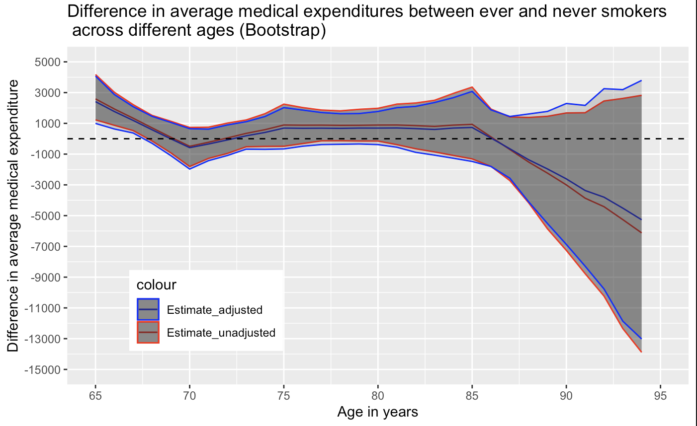

```{r setup, include=FALSE}
knitr::opts_chunk$set(echo = TRUE)
```

```{r}
library(medicaldata)
library(tidyverse)
library(splines)
load("nmes.rdata")

d <- nmes |> 
  filter(lastage == 65) |> 
  filter(!is.na(lastage) & !is.na(totalexp) & !is.na(eversmk)) |>
  filter(eversmk != ".") |>
  arrange(lastage) |>
  mutate(ever = eversmk) 

# two-sample t-test
t_test <- t.test(totalexp~ever,data=d,var.equal=TRUE)
t_test
# analysis of variance
aov_summary <- summary(aov(totalexp ~ ever, data = d))
# simple linear regression
slm <- lm(totalexp ~ ever, data = d)
summary(slm)

```

```{r}
data1 <- nmes |> 
  filter(lastage >= 65) |> 
  filter(!is.na(lastage) & !is.na(totalexp) & !is.na(eversmk)) |>
  filter(eversmk != ".") |>
  arrange(lastage)
```

Fit a MLR of expenditures on age and smoking status as:

```{r}
data1 <- data1 |>
  mutate(
    age = lastage,
    agem65 = age - 65,
    age_sp1 = ifelse(age>=75, age -75, 0),
    age_sp2 = ifelse(age>=85, age-85, 0),
    ever = eversmk
         ) 

# Number of patients by ever smoker
data1 %>%
 summarise(num_smoker = n_distinct(pidx),
           mean_age = mean(age),
           sd_age = sd(age))

data1 %>%
 group_by(ever) %>%
 summarise(num_smoker = n_distinct(pidx),
           mean_age = mean(age),
           sd_age = sd(age))
```

## Q1 check the assumption

#### assumption E(Y \|X) = X $\beta$

```{r}
fit = lm(data = data1, totalexp~agem65 + age_sp1 + age_sp2 + ever + ever*(agem65 + age_sp1 + age_sp2))

res.fit = lm(fit$residual~ ns(data1$age,4))
data1$residuals = residuals(fit)

#data1$residuals = residuals(model1)
ggplot(data1,aes(x=age, y= residuals)) +
    geom_jitter(alpha = 0.7) +
    theme_bw() +
    geom_smooth(aes(x = data1$age, y = res.fit$fitted.values), method = 'loess') +
    geom_hline(yintercept=0,color="red") +
    labs(y="Residuals: linear age",x="Age in months") +
    scale_y_continuous(breaks=seq(-5000,5000,1000),limits=c(-5000,5000)) +
  scale_x_continuous(breaks=seq(65,95,10),limits=c(65,95))
```

```{r}
data1 <- data1 |>
  mutate( age_sp0 = ifelse(age>=70, age -70, 0) ) 

model2 <- lm(data = data1, totalexp~ agem65 + age_sp0 + age_sp1 + age_sp2 + ever + ever*(agem65 + age_sp0 + age_sp1 + age_sp2))

# check the mean model
res.fit2 = lm(model2$residual~ ns(data1$age,knots = 4))
data1$residuals2 = residuals(model2)

ggplot(data1,aes(x=age, y= residuals2)) +
    geom_jitter(alpha = 0.7) +
    theme_bw() +
    geom_smooth(aes(x = data1$age, y = res.fit2$fitted.values), method = 'loess') +
    geom_hline(yintercept=0,color="red") +
    labs(y="Residuals: linear age",x="Age in months") +
    scale_y_continuous(breaks=seq(-5000,5000,1000),limits=c(-5000,5000)) +
  scale_x_continuous(breaks=seq(65,95,10),limits=c(65,95))
```

We could see the alternative model is more suitable with most residuals equal to 0.

## Q2 Potential confounder

male: 1 -- male, 0 -- female RACE3: 1 -- white, 2 -- black, 3 -- other educate: Education: 1 -- college grad, 2 -- some college, 3 -- hs grad, 4 -- other marital: 1 -- married, 2 -- widowed, 3 -- divorced, 4 -- separated, 5 -- never married povstalb: Poverty status: 1 -- poor, 2 -- near poor, 3 -- low income, 4 -- middle income, 5 -- high income

```{r}
model_adjusted <- lm(data = data1, totalexp~ agem65 + age_sp0 + age_sp1 + age_sp2 + ever + ever*(agem65 + age_sp0 + age_sp1 + age_sp2) + male + RACE3 + educate + marital + povstalb)

summary(model_adjusted)
```

## Q3 unadjusted and adjusted difference

We choose the bootstrap procedure to estimate the unadjusted and adjusted differences in average medical expenditures between ever and never smokers as a function of age, with correspnding standard errors and confidence intervals. But we also calculate the model-based standard errors.

### model-based standard error

```{r}
model2 <- lm(data = data1, totalexp~ agem65 + age_sp0 + age_sp1 + age_sp2 + ever + ever*(agem65 + age_sp0 + age_sp1 + age_sp2))

summary(model2)
coef_unadjusted <- model2$coefficients

# Function to calculate the difference in expenditures between ever and never smokers
expenditure_difference <- function(age) {
  agem65 <- age - 65
  age_sp0 <- ifelse(age >= 70, age - 70, 0)
  age_sp1 <- ifelse(age >= 75, age - 75, 0)
  age_sp2 <- ifelse(age >= 85, age - 85, 0)
  coef_unadjusted["ever1"] + coef_unadjusted["agem65:ever1"] * agem65 + 
  coef_unadjusted["age_sp0:ever1"] * age_sp0 + coef_unadjusted["age_sp1:ever1"] * age_sp1 + 
  coef_unadjusted["age_sp2:ever1"] * age_sp2
}


linear_combination <- function(age) {
  # Adjustments for age splines
  agem65 <- age - 65
  age_sp0 <- ifelse(age >= 70, age - 70, 0)
  age_sp1 <- ifelse(age >= 75, age - 75, 0)
  age_sp2 <- ifelse(age >= 85, age - 85, 0)
  
  lc <- c(0, 0, 0, 0, 0, 1, agem65, age_sp0, age_sp1,age_sp2 )
  matrix(lc, nrow = length(lc), ncol = 1)
}

ages <- 65:94
differences <- numeric(length(ages))
standard_errors <- numeric(length(ages))
lower_bounds <- numeric(length(ages))
upper_bounds <- numeric(length(ages))

reg1.vc <- vcov(model2)

for (i in seq_along(ages)) {
  differences[i] <- expenditure_difference(ages[i])
  lc <- linear_combination(ages[i])
  var <- t(lc) %*% reg1.vc %*% lc
  standard_errors[i] <- sqrt(diag(var)[1]) # The diagonal contains variances for each coefficient, we take the first
  lower_bounds[i] <- differences[i] - 1.96 * standard_errors[i]
  upper_bounds[i] <- differences[i] + 1.96 * standard_errors[i]
}

# Combine the ages, differences, and standard errors into a data frame for easy viewing
results <- data.frame(
  Age = ages,
  ExpenditureDifference = differences,
  StandardError = standard_errors,
  Lower95CI = lower_bounds,
  Upper95CI = upper_bounds
)

# View the results
print(results)


```

```{r}
plot_0 <- ggplot(results, aes(x = Age, y = ExpenditureDifference)) + 
  geom_point() + 
  geom_line(aes(y = ExpenditureDifference)) + # Plot the fitted line
  geom_ribbon(aes(ymin = Lower95CI, ymax = Upper95CI), alpha = 0.3) +  
  labs(title = "Difference in average medical expenditures vs. age (model-based)",
       x = "Age in years",
       y = "Difference in average medical expenditure") +
  theme_minimal() +
  scale_y_continuous(breaks=seq(-15000,5000,2000),limits=c(-15000,5000)) +
  scale_x_continuous(breaks=seq(65,95,5),limits=c(65,95))

plot_0
```

### bootstrap standard error

### Unadjusted difference:

```{r boot Q4, message=FALSE, warning=FALSE}
# Set seed
set.seed(653)
library(boot)

# Define a function to calculate the difference in expenditures
difference_calc <- function(data, indices, age) {
  # Ensure the data is correctly sampled
  resample <- data1[indices, ]
  
  # Calculate the age terms for the specified age
  agem65 <- age - 65
  age_sp0 <- ifelse(age >= 70, age - 70, 0)  
  age_sp1 <- ifelse(age >= 75, age - 75, 0)
  age_sp2 <- ifelse(age >= 85, age - 85, 0)
  
  # Fit the model on the sampled data
  fit <- lm(totalexp ~ agem65 + age_sp0 + age_sp1 + age_sp2 + ever + ever*(agem65 + age_sp0 + age_sp1 + age_sp2), data = resample)
  
  # Calculate the difference using the model coefficients
  coef_fit <- coef(fit)
  difference <- coef_fit["ever1"] + 
                coef_fit["agem65:ever1"] * agem65 + 
                coef_fit["age_sp0:ever1"] * age_sp0 +
                coef_fit["age_sp1:ever1"] * age_sp1 + 
                coef_fit["age_sp2:ever1"] * age_sp2
  
  return(difference)
}

```

```{r}
# Perform the bootstrap for each age
results <- lapply(65:94, function(age) {
  boot(data1, difference_calc, R = 1000, age = age)
})

# Extract the bootstrap standard errors and confidence intervals
bootstrap_results <- sapply(results, function(b) {
  se <- boot.ci(b, type = "perc")
  return(c(Estimate = mean(b$t), SE = sd(b$t), CI_lower = se$percent[4], CI_upper = se$percent[5]))
})

# Combine the results into a data frame
bootstrap_results_df <- as.data.frame(t(bootstrap_results))
names(bootstrap_results_df) <- c("Estimate", "SE", "CI_lower", "CI_upper")
row.names(bootstrap_results_df) <- paste("Age in years", 65:94) 

# Print the results
bootstrap_results_df$age = c(65:94)
print(bootstrap_results_df)

```

```{r}
plot_1 <- ggplot(bootstrap_results_df, aes(x = age, y = Estimate)) + 
  geom_point() + 
  geom_line(color="red") + 
  geom_ribbon(aes(ymin = CI_lower, ymax = CI_upper), alpha = 0.2) +  
  labs(title = "Difference in average medical expenditures between ever and never smokers across different ages (unadjusted model)",
       x = "Age in years",
       y = "Difference in average medical expenditure") +
  theme_minimal() + 
  scale_y_continuous(breaks=seq(-15000,5000,2000),limits=c(-15000,5000)) +
  scale_x_continuous(breaks=seq(65,95,5),limits=c(65,95))

plot_1
```

### Adjusted difference:

```{r}
# Set seed for reproducibility
set.seed(653)
# Adjusted function to calculate the difference in expenditures
difference_calc_adjusted <- function(data, indices, age) {
  # Ensure the data is correctly sampled
  resample <- data[indices, ]
  
  # Calculate the age terms for the specified age
  agem65 <- age - 65
  age_sp0 <- ifelse(age >= 70, age - 70, 0)  
  age_sp1 <- ifelse(age >= 75, age - 75, 0)
  age_sp2 <- ifelse(age >= 85, age - 85, 0)
  
  # Fit the adjusted model on the sampled data
  fit_adjusted <- lm(totalexp ~ agem65 + age_sp0 + age_sp1 + age_sp2 + ever + ever*(agem65 + age_sp0 + age_sp1 + age_sp2) + male + RACE3 + educate + marital + povstalb, data = resample)
  
  # Calculate the difference using the model coefficients
  coef_fit_adjusted <- coef(fit_adjusted)
  difference <- coef_fit_adjusted["ever1"] + 
                coef_fit_adjusted["agem65:ever1"] * agem65 + 
                coef_fit_adjusted["age_sp0:ever1"] * age_sp0 +
                coef_fit_adjusted["age_sp1:ever1"] * age_sp1 + 
                coef_fit_adjusted["age_sp2:ever1"] * age_sp2
  
  return(difference)
}

# Perform the bootstrap for each age from 65 to 94
results_adjusted <- lapply(65:94, function(age) {
  boot(data1, difference_calc_adjusted, R = 1000, age = age)
})

# Extract the bootstrap standard errors and confidence intervals
bootstrap_results_adjusted <- sapply(results_adjusted, function(b) {
  se <- boot.ci(b, type = "perc")
  return(c(Estimate = mean(b$t), SE = sd(b$t), CI_lower = se$percent[4], CI_upper = se$percent[5]))
})

# Combine the results into a data frame
bootstrap_results_df_adjusted <- as.data.frame(t(bootstrap_results_adjusted))
names(bootstrap_results_df_adjusted) <- c("Estimate", "SE", "CI_lower", "CI_upper")
row.names(bootstrap_results_df_adjusted) <- paste("Age", 65:94)

# Print the results
bootstrap_results_df_adjusted$age = c(65:94)
print(bootstrap_results_df_adjusted)
```

```{r}
plot_2 <- ggplot(bootstrap_results_df_adjusted, aes(x = age, y = Estimate)) + 
  geom_point() + 
  geom_line(color="blue") + # Plot the fitted line
  geom_ribbon(aes(ymin = CI_lower, ymax = CI_upper), alpha = 0.2) +  
  labs(title = "Difference in average medical expenditures between ever and never smokers \n across different ages (adjusted model)",
       x = "Age in years",
       y = "Difference in average medical expenditure") +
  theme_minimal() + 
  scale_y_continuous(breaks=seq(-15000,5000,2000),limits=c(-15000,5000)) +
  scale_x_continuous(breaks=seq(65,95,5),limits=c(65,95))

plot_2
```

```{r}
Plot_combine <- ggplot(bootstrap_results_df_adjusted, aes(x = age, y = Estimate)) + 
  geom_line(data = bootstrap_results_df, aes(x = age, y = Estimate, color="Estimate_unadjusted")) +
  geom_line(data= bootstrap_results_df_adjusted, aes(x = age, y=Estimate,color="Estimate_adjusted")) +
  labs(title = "Difference in average medical expenditures between ever smokers and never smokers", 
       y = "Average difference of expenditures", 
       x = "Age in years") +
  geom_ribbon(data = bootstrap_results_df, aes(ymin = CI_lower, ymax = CI_upper, color="Estimate_unadjusted"), alpha=0.5) + 
  geom_ribbon(data= bootstrap_results_df_adjusted, aes(ymin = CI_lower, ymax = CI_upper, color="Estimate_adjusted"), alpha=0.2)  + 
    labs(title = "Difference in average medical expenditures between ever and never smokers \n across different ages (Bootstrap)",
       x = "Age in years",
       y = "Difference in average medical expenditure") + 
   scale_color_manual(values = c("Estimate_unadjusted" = "red","Estimate_adjusted"="blue")) +
   scale_y_continuous(breaks=seq(-15000,5000,2000),limits=c(-15000,5000)) +
   scale_x_continuous(breaks=seq(65,95,5),limits=c(65,95)) +
   geom_hline(yintercept = 0, color = "black", linetype = "dashed" ) + 
   theme(legend.position = c(0.1, 0.1), legend.justification = c(0, 0))

Plot_combine

```

## Q4 Findings

Write up the findings with sections: objective, data, methods, results, summary as if for a health services journal.

**Objective**: This analysis aims to explore if the difference in average medical expenditures of patients comparing ever and never smokers changes with age.

**Data**: We use the 1987 National Medical Expenditure Survey (NMES) Dataset extract from Johns Hopkins Biostatistics Center. This data contains detailed information on health expenditures through the use of several component surveys.

**Methods**: First, we fit a multiple linear regression model for total expenditure as a linear spline function of age (knots at 70, 75 and 85 years of age), smoking status (ever smoker vs. never smoker) and the interaction of age terms and smoking status. We conduct the analysis to check the appropriateness of the mean model. Then we implemented an adjusted model included sex (male vs. female), race (white, black, other), education (college grad, some college, hs grad, other), marital status (married, widowed, divorced, separated, never married), poverty status (poor, near poor, low income, middle income, high income) as the covariates. The standard error and 95% confidence intervals (CIs) for unadjusted and adjusted difference in average medical expenditure between ever and never smokers as a function of age, were constructed via the percentile bootstrap procedure using 1000 bootstrap samples of participants. Analyses were performed in R, version 4.3.1 (R Foundation).

**Results**: There are 4728 participants aged 65 to 94 included in the analysis, with mean age of 73.42 (SD = 6.43) years and half were ever smoker (51.2%) .
The unadjusted regression analysis indicates that at age 65, never smokers have an estimated mean total medical expenditure of 2106.76 dollars, while ever smokers have higher medical expenditure of 4668.81 dollars. The interaction of age and smoking status are significant when adults aged 65-70 years and 70-75 years. Using percentile bootstrap procedure, the difference in expenditure between ever and never smokers at age 65 is 2589.62 dollars (95% CI 1227.30 to 4146.03). This difference declines with age when adults aged 65 to 70, as seen in the figure 1. For adults aged 70, the differences in medical expenditure between ever and never smokers are -492.24 (95%CI -1805.98 to 733.48). Then the difference increases with age when adults aged 70 to 75. For adults aged 75, the differences in medical expenditure between ever and never smokers are 893.76 (95%CI -490.40 to 2249.51). Then the difference declines with age when adults aged 75 to 94. For adults aged 85 and 94, the differences in medical expenditure between ever and never smokers are 937.31 (95%CI -1311.52 to 3358.81) and -5269.00 (95% CI -13021.07 to  3794.57) respectively. But the difference when aged 70 to 94 are not statistically significant as their confidence intervals include zero (Figure 1).
In the adjusted model, the estimated average medical expenditure for ever smokers was significantly higher than never smokers by \$2389.28 (SE = 798.32, p = 0.003), adjusting for sex, race, education, marital status, and poverty status. The interaction of age and smoking status remained significant when adults aged 65-70 years and 70-75 years. Using percentile bootstrap procedure, the difference in expenditure between ever and never smokers at age 65 is 2412.17 dollars (95% CI 996.15 to 4078.04). For ages 70, 75 and 85, the differences in medical expenditure between ever and never smokers are -579.06 (95%CI -1971.95 to 656.05), 691.92 (95%CI -663.54 to 2024.38), and 732.43 (95%CI -1477.30 to 3078.06) respectively, but these are not statistically significant as their confidence intervals include zero (Figure 1).

{width="500"}

Figure 1: Difference in average medical expenditures between ever and never smokers across different ages (Bootstrap Model)


**Discussion**: Our analysis shows that ever smokers have higher medical expenditures than never smokers, and this difference is affected by age. The estimated difference in expenditure between ever and never smokers decreases with age when adults aged 65-70 years, increases with age when adults aged 70-75 years, and then continue decreases with age for adults aged above 75 years. After adjusting for demographic and socioeconomic factors, the difference remains significant for adults aged 65-75 years. This suggests that the impact of smoking on healthcare costs persists across different age groups. Overall, the findings underscore the health economic impact of smoking and the influence of age and sociodemographic variables on medical expenditures.
The bootstrap estimates confirm our initial findings that while ever smokers tend to have higher medical expenditures at earlier ages, this difference diminishes and becomes nonsignificant as individuals age, particularly after the age of 70. The observed variability in the trend at age 70 may suggest a complex relationship between aging and healthcare costs influenced by smoking status, potentially indicating a survival bias. The bootstrap results, particularly the wide confidence intervals at older ages, highlight the increasing uncertainty about expenditure differences in this older population. Despite adjusting for some demographic and socioeconomic factors, there could be other confounders that influence both smoking status and medical expenditures that were not available in the NMES dataset. These could include environmental exposures, lifestyle factors (like diet and physical activity), and access to healthcare services. Without accounting for these factors, the estimated effect of smoking on medical expenditures might be biased. 


```{r}
Plot_combine <- ggplot(bootstrap_results_df_adjusted, aes(x = age, y = Estimate)) + 
  geom_line(data = bootstrap_results_df, aes(x = age, y = Estimate, color="Estimate_unadjusted")) +
  geom_line(data= bootstrap_results_df_adjusted, aes(x = age, y=Estimate,color="Estimate_adjusted")) +
  labs(title = "Difference in average medical expenditures between ever smokers and never smokers", 
       y = "Average difference of expenditures", 
       x = "Age in years") +
  geom_ribbon(data = bootstrap_results_df, aes(ymin = CI_lower, ymax = CI_upper, color="Estimate_unadjusted"), alpha=0.5) + 
  geom_ribbon(data= bootstrap_results_df_adjusted, aes(ymin = CI_lower, ymax = CI_upper, color="Estimate_adjusted"), alpha=0.2)  + 
    labs(title = "Difference in average medical expenditures between ever and never smokers \n across different ages (Bootstrap)",
       x = "Age in years",
       y = "Difference in average medical expenditure") + 
   scale_color_manual(values = c("Estimate_unadjusted" = "red","Estimate_adjusted"="blue")) +
   scale_y_continuous(breaks=seq(-15000,5000,2000),limits=c(-15000,5000)) +
   scale_x_continuous(breaks=seq(65,95,5),limits=c(65,95)) +
   geom_hline(yintercept = 0, color = "black", linetype = "dashed" ) + 
   theme(legend.position = c(0.1, 0.1), legend.justification = c(0, 0))

Plot_combine

```


```{r}
library(ggplot2)
data = data1
colnames(data)

data$residuals = scale(data$residuals)
data$packyears = as.numeric(data$packyears)
data$packyears = scale(data$packyears)*10

# 绘制图形
ggplot(data, aes(x = age)) +
  geom_bar(aes(y = sqrt(residuals^2)), 
           stat = "identity", fill = "skyblue") + # 柱状图
  geom_smooth(aes(y = packyears),
              method = 'loess',
              se = TRUE,
              colour = "red") + # 折线图，调整y2的比例以适配y1的量纲
  scale_y_continuous(
    name = "Primary Y-axis",
    sec.axis = sec_axis(~., name = "Secondary Y-axis") # 添加第二个y轴，并反向调整比例因子
  ) +
  theme_minimal()

```

